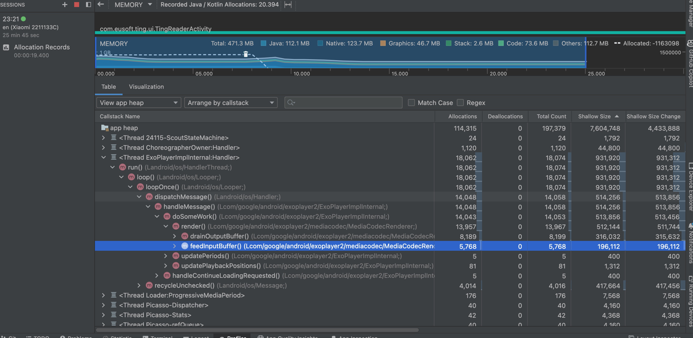

## 内存分析

ExoPlayer 播放本地视频，内存一直增加的问题

### chatGPT 回答我的

问：ExoPlayerImplInternal render() MediaCodedRenderer 申请了大量对象，占用了很多内存

答：
ExoPlayerImplInternal 是 ExoPlayer 内部的一个关键组件，负责管理播放器的状态、事件处理、播放控制等核心功能。MediaCodecRenderer 是 ExoPlayer 中负责使用 MediaCodec 进行硬件解码的组件之一。当 ExoPlayerImplInternal 中的 MediaCodecRenderer 进行渲染操作时，可能会涉及大量的对象创建和内存分配。

以下是一些可能导致大量对象创建和内存占用的原因：

视频解码过程中的缓冲区和帧数据：在视频解码过程中，会涉及到大量的缓冲区和帧数据的创建和处理。这些数据结构通常需要占用大量的内存空间，尤其是对于高分辨率、高比特率的视频文件。

资源管理不当：如果在解码过程中没有正确管理资源，可能会导致对象创建后没有及时释放，从而造成内存泄漏。

垃圾回收不及时：在某些情况下，垃圾回收器可能无法及时回收不再使用的对象，导致内存占用持续增加。

为了解决这个问题，你可以尝试以下方法：

优化视频解码流程：尽可能减少不必要的对象创建和内存分配，优化视频解码过程，提高内存使用效率。

检测和解决内存泄漏：使用内存分析工具（如Android Profiler、MAT等）来检测内存泄漏，并确定造成内存泄漏的原因，及时释放不再需要的对象和资源。

优化资源管理：确保在不再需要时及时释放资源，尤其是在视频解码结束后。

使用最新版本的 ExoPlayer：ExoPlayer 的更新版本可能会修复一些内存管理方面的问题，使用最新版本可能有助于减少内存占用。