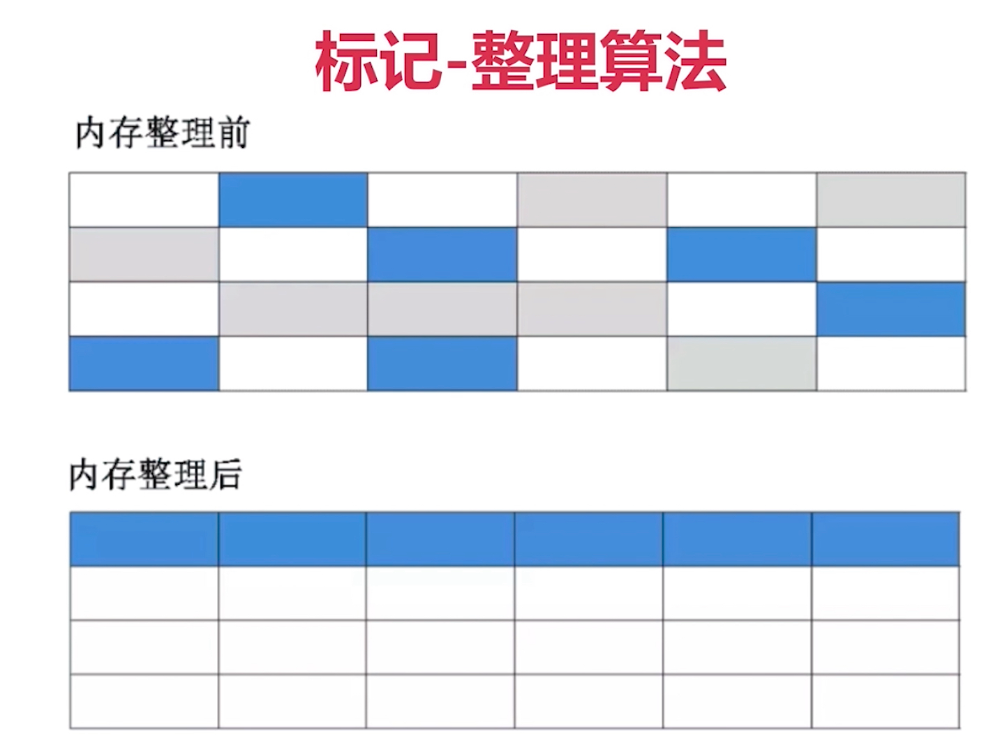

### Android 内存管理机制

- Java 内存管理机制
- Android 内存管理机制

#### Java 内存管理机制

- 方法区
- 虚拟机栈
- 本地方法栈
- 堆
- 程序计数器

##### Java 内存回收算法

- 标记-清除算法
  - 标记出所有需要回收的对象
  - 统一回收所有被标记的对象
  - 缺点
    - 效率不高
    - 会产生很多不连续的碎片
- 复制算法
  - 将内存划分为大小相等的两块
  - 一块内存用完之后，复制存活的对象到另一块
  - 清理另一块内存
  - 特点
    - 实现简单，运行高效
    - 浪费一半空间，代价大
- 标记-整理算法
  - 标记过程和「标记-清除」算法一样
  - 存活对象往一端移动
  - 清理其余内存]
  - 特点
    - 避免内存不连续，导致有内存碎片
    - 避免复制算法到空间浪费
- 分代收集算法
  - 结合多种收集算法优势
  - 新生代对象存活率低，复制（按照比例）
  - 老年代对象存活率高，标记-整理

