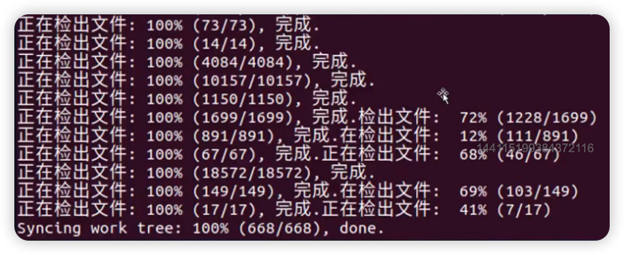

## AOSP 源码和内核源码下载

- 准备好 ubuntu 系统

### AOSP 源码下载

- AOSP: android open source project
  - Google 开放的 Android 开源项目，
  - [中文网](https://source.android.google.cn/)
  - 通过它可以定制 Android 操作系统
  - 国内手机厂商都是在次基础上开发的定制系统
  - 因为有墙，没法直接连接谷歌服务获取 AOSP 源码，可以从国内镜像站获取
    - [清华大学镜像站](https://mirrors.tuna.tsinghua.edu.cn/help/AOSP/ )
    - [中科大镜像站](https://lug.ustc.edu.cn/wiki/mirrors/help/aosp)

#### 下载 AOSP

- Android 源码包包含数百个 git库，光是下载这么多的g git库就是一项繁重的任务
- 所以 google 开发了 repo
  - 用于管理 Android 版本库的一个工具
  - 使用了 python 对 git 进行了一定的封装
  - 简化了对多个 git 版本库的管理

##### 先下载 repo

- 创建 bin 目录：`mkdir ~/bin`
- 把 bin 目录添加到 PATH 变量中: ``PATH=~/bin:$PATH``
- 安装 curl 
- 下载 repo，并设置权限
  ```shell
   curl https://mirrors.tuna.tsinghua.edu.cn/git/git-repo > ~/bin/repo
  ```
- 设置 repo 权限
  - ``chmod a+x ~/bin/repo``
- 安装 python
- 重启 Ubuntu 虚拟机
- 打开终端，下载源码exp
- 创建目录：aosp：`mkdir aosp`，进入该目录中：`cd aosp`
- 执行命令:
  - ``export REPO_URL='https://mirrors.tuna.tsinghua.edu.cn/git/git-repo/''``
- 配置git信息，邮箱 + 姓名
- 初始化仓库版本
  - ``repo init -u https://aosp.tuna.tsinghua.edu.cn/platform/manifest -b android-11.0.0_r1``
- 同步源码
  - ``repo sync``
- 看到下面的信息就说明下载成功了
