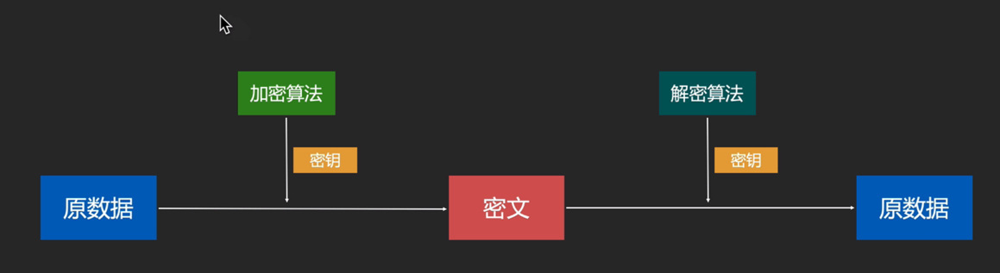
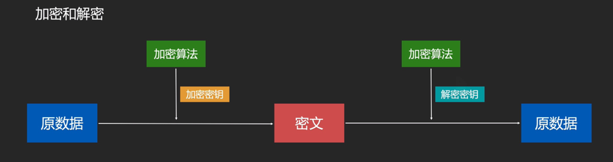

## 编码、加密、Hash、序列化和字符集

很实用，但真正会的人却很少

### 0. 涉及内容

- 编码(Encoding)、解码(Decoding)
- 加密(Encryption)、解密（Decryption）
- 数字签名(Digital Signature)
- 压缩(Compression)、解压缩(Decompression)
- 序列化(Serialization)
- 哈希（Hash）
- 字符集(Charset)

经常用到，但需要真正理解才能正确使用

---

### 密码学

#### 现代密码学

- 可以加密文字，也可以加密二进制数据

- 对称加密

  - 原理： 用 **密钥** 和 **加密算法** 对数据进行转换，得到无意义的数据即为 **密文**。
  - 使用 **密钥** 和 **解密算法** 对密文进行逆向转换，得到原数据。
  - 如图：
    
  - 经典算法：DES ，AES
    - DES 被弃用了: 密钥太短了

- 非对称加密
  - 使用 **公钥** 对数据加密得到 **密文**
  - 使用 **私钥** 对数据解密得到 **原数据**
  - 如图：

    

  - 用复杂的数学算法
  - 延伸通途： 数字签名
    - 私钥签名、公钥验证
  - 公钥和私钥不能对调，一旦确定下来不能更改了。
  - 公钥和私钥加密的内容，相互可以解密

##### 对称加密的缺点

密钥会被截获

#### 数字签名

- 42 min -54 min

- **私钥** 签名，**公钥** 验证

- 如图：

  

- 经典算法：RSA, DSA

  - DSA: 专用来签名

---

#### 密码学密钥和登录密码

- 密钥：key

  - 场景：用于加密和解密

  - 目的：保证数据被盗时，内容不会被别人读懂

- 登录密码：password

  - 场景： 用户进入网站前的身份验证
  - 目的：数据提供方或应用服务方对账户拥有者数据的保护，保证 你是你。
  - 焦点：身份

---

### Base64

将 二进制 数据转换成由 64 个字符组成的字符串的编码算法

**什么是二进制数据？**

- 广义上：计算机存储的数据
- 狭义上：**非文本数据**

**组成：**

英文字母大小写 , 0~9 ,+ , /

**编码：**

把二进制展开，每 6 bit 一组，然后根据转换表，转换成字符。

**用途：**

- 让原数据具有字符串所具有的特性，如：可以放在 URL 中传输，可以保存到文本文件，可以通过普通聊天软件进行文本传输。
- 把原本肉眼可以都统的字符串变成读不懂的字符串，减低偷窥风险
- 变种：Base58
  - 比特币存地址的

---

### URL encoding

- 将 URL 中保留字符用 “%” 进行编码

- 目的：消除歧义，避免解析错误

###压缩和解压缩

- 压缩：把数据换一种方式存储，减少存储空间

- 解压缩：把压缩后的数据还原成原来的形式
- 常见压缩算法：DEFLATE(ZIP 文档)、JPEG、MP3

### 序列化

把数据对象(一般是内存中的，例如：JVM 中的对象) 转换成字节序列的过程。

- **反序列化：** 把字节序列重新转换成内存中的对象
- 目的：让内存中的对象可以被存储和传输

### Hash（★）

定义：把任意数据转换成指定大小范围（通常很小）的数据

- 作用：摘要、数字指纹
- 经典算法：MD5、SHA1、SHA256
- 避免碰撞
- 实际用途
  - 数据完整性验证
  - 身份的快速匹配、查找：HashCode()、HashMap
  - 隐私保护： 
    - 网站保存用户的密码，不用明文，而是保存密码的 HashCode
    - 早期，网站明文保存密码，还可以密码找回。现在的网站为了安全保存的是密码的 Hash 值，是无法保存密码的，只能重新设置密码。
    - 彩虹表：存放常见的密码的 hash 值，用于破解
    - 加盐
- 不是编码，因为不可逆
- 签名与验证
  - 对数据的摘要签名

### 字符集

含义：一个由整数向现实世界中的文字符号的 Map

#### 分支

- ASCII

  128 个字符，1 byte

- Unicode

  13 万个字符，多字节

  - UTF-8: Unicode 的编码分支
  - UTF-16: Unicode 的编码分支

  对于某些编辑器，Unicode 代表 Unicode 下的某一种编码

- GBK

  中国自研标准，多字节、字符集 + 编码

  早期 GBK 还能与 Unicode 争霸，但现在世界广泛的使用 Unicode了。

