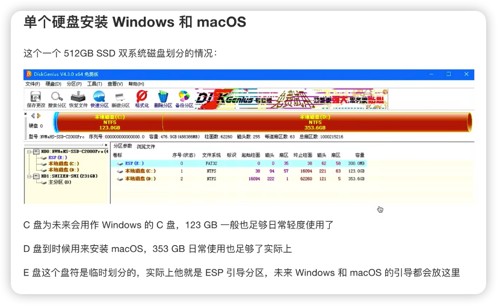

## 黑苹果教程

[B站教程](https://www.bilibili.com/video/BV1yq4y1o7cT?p=3&vd_source=82b7ac2fbd7ece380f983e2c23199d99)

- UEFI 引导磁盘

### UEFI相关概念

UIFI（Unified Extensible Firmware Interface）统一可扩展固件接口，可以让 PC 从预启动的操作环境，加载到操作系统上。可以理解为 UEFI 是一种系统引导方式，基本上 2010 年后的电脑都支持这种引导方式。

UEFI 引导常配合 GPT 分区表来使用，在 DiskGenius 中，选中「磁盘」，右键选「转换分区表类型为 GUID格式」即可将磁盘转换为 GPT 分区表。

#### EFI 分区

EFI分区是 UEFI 引导必备的一个分区，在磁盘当中都名称一般叫做 ESP 分区，大多位于磁盘的第 1 个分区，格式通常为 FAT16 或 FAT32，追要用来保存引导文件。安装黑苹果的话，注意 ESP 的分区要 > 200MB。

